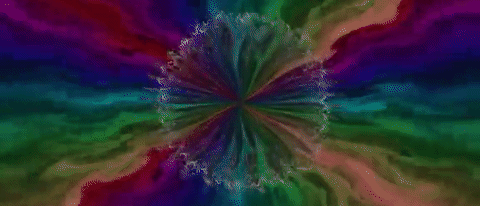

# Music Visualization

An audio visualizer for microphone input or mp3 files.

### Features

- draws audio waveform as a white ring
- draws audio frequency spectrum as colored bands
- subjects these elements to delta fields for diverse, fluid effects

### Controls

- drag-and-drop an mp3 file onto the app to play and visualize it
- press `left/right arrows` to cycle through flow fields
- press `r` to load a random flow field 
- press `s` to display settings
- press `m` to show mouse cursor

